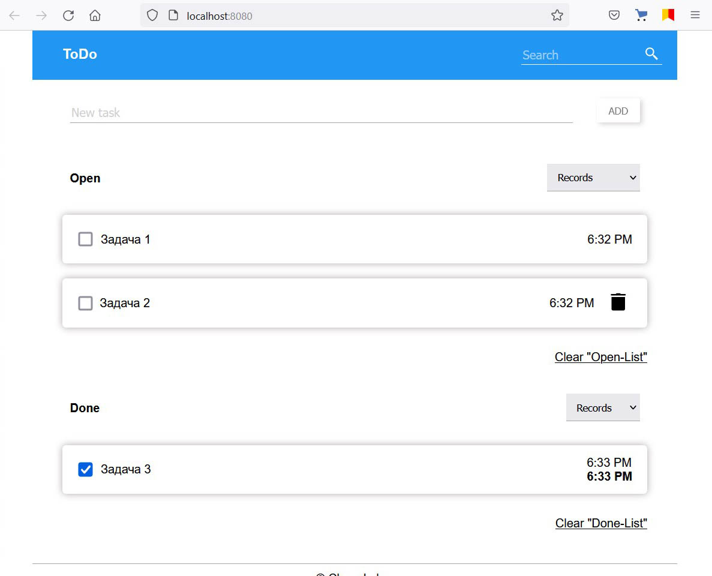

# Todo List 

The practice task is a simple Todo List application written without using libraries with pure JS only. 

## Basic requirement 

1. Interface has view/add/edit/delete Todo list items 
1. The application consists of two lists: Open and Done 
1. Each entry in the lists have two statuses: completed and open 
1. Each entry in the lists have creation time and done time 
1. Each list have sort by records, creation time and done time

